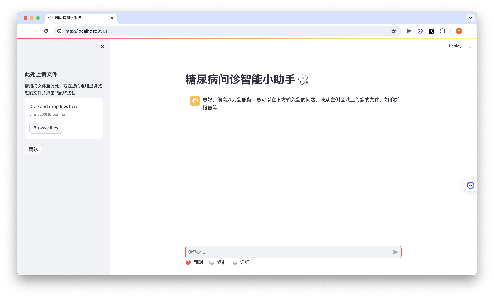

# LLM-based Diabetes Consultation System | 基于大语言模型的糖尿病问诊系统

A diabetes consultation system based on large language models (LLMs), which provides more accurate and real-time consultation suggestions by combining diabetes knowledge from the knowledge base with RAG technology.

基于大语言模型（LLMs）的糖尿病问诊系统，利用检索增强（RAG）技术，结合知识库中的糖尿病知识，提供更加准确和实时的诊疗建议。

## System Framework ｜ 系统框架

## System data flow ｜ 系统数据流

## User Interface ｜ 用户界面

- Initial Interface ｜ 初始界面

- Text Consultation ｜ 文字问诊

- File UpLoad ｜ 上传文件

## How to run ｜ 如何运行

1. Make sure you have [Ollama](https://ollama.com/) insatlled on your machine. | 确保你本地已经安装好[Ollama](https://ollama.com/)。

2. Run `bash setup.sh`. ｜ 运行`bash setup.sh`。

3. Replace the `OPENAI_API_KEY` in `.env` with your own apikey. | 将`.env`中的`OPENAI_API_KEY`替换成你自己的apikey。

4. Add or delete documnets in `docuemnts` folder. | 在`docuemnts`文件夹中添加或删除文档。

5. Select embedding model in `model_and_embedding.py` file. Please note that if you choose to use OpenAI's model, you may run into rate limits if you have a lot of documents. ｜ 在`model_and_embedding.py`文件中选择嵌入模型。请注意，如果你选择使用OpenAI的嵌入模型，如果你有很多文档，可能会遇到速率限制。

6. Run `python update_databse.py` to update the database. If you need to clear the database, just add `--reset` parameter. | 运行`python update_databse.py`更新数据库。如果你需要清除数据库，只需添加`--reset`参数。

7. Run `python -m streamlit run ui.py` to start the app. | 运行`python -m streamlit run ui.py`启动应用。
